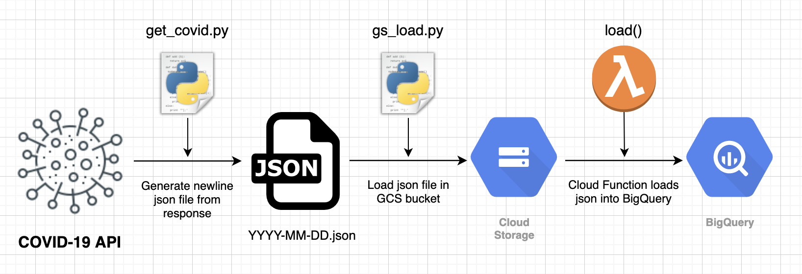

# Covid Data Ingestion

## Objective

The objective of this project is to explore beginner data engineering concepts and how data pipelines can be built. I will use this opportunity to learn about the Google Cloud Platorm as well.

## Technicals

How the data flows:

<ol>
  <li>Send request to Covid-19 API for daily snapshot data. Get rid of unneeded key/value pairs and store response in a JSON file locally</li>
  <li>Using Google Cloud Storage API, load JSON into the bucket</li>
  <li>Call the Cloud Function to load JSON into BigQuery dataset as a single table (Functions getss triggered whenever a new JSON lands in bucket</li>
  <li>Visualisation tool to get data from BigQuery?</li>
</ol>
